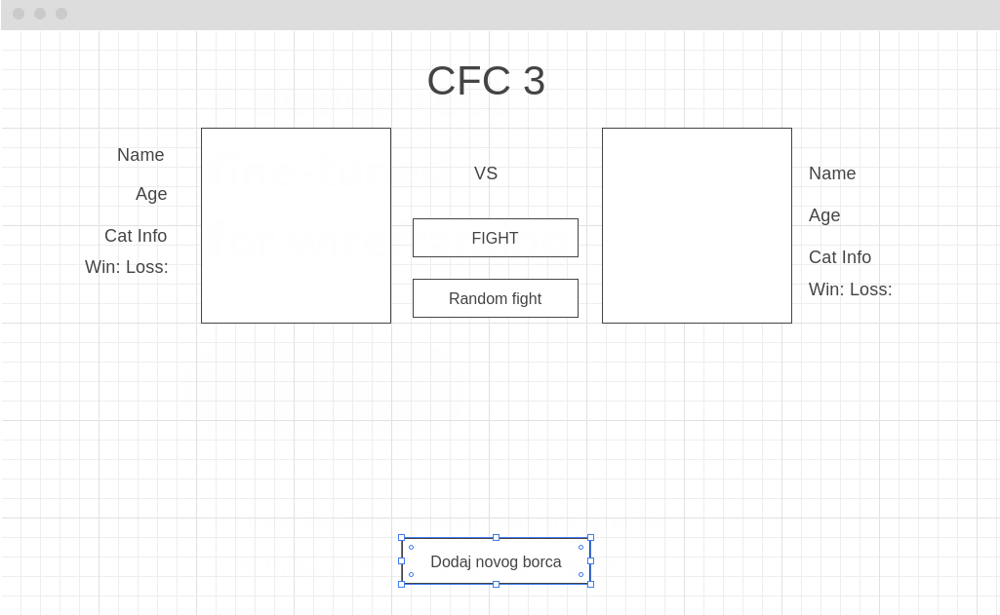
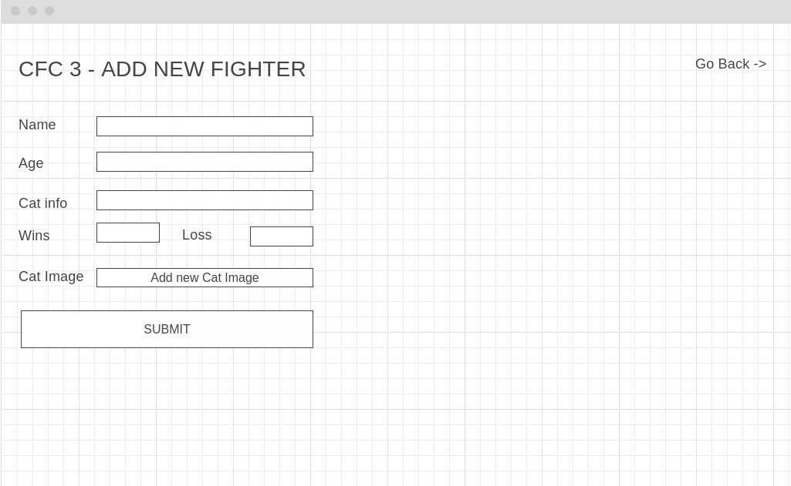
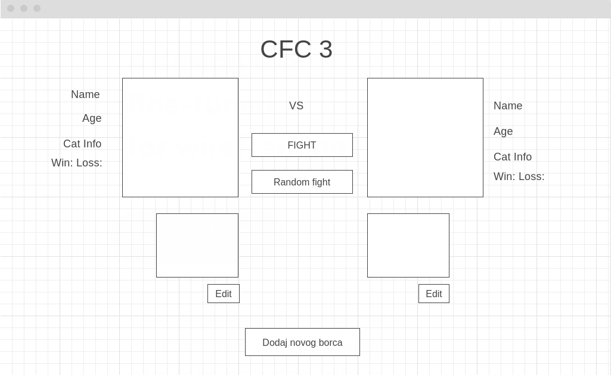
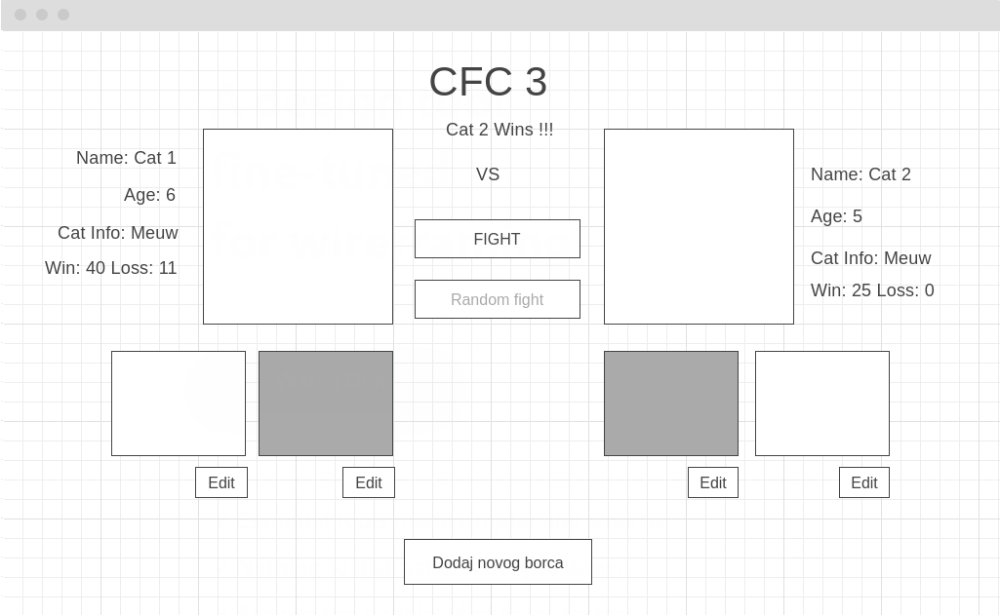
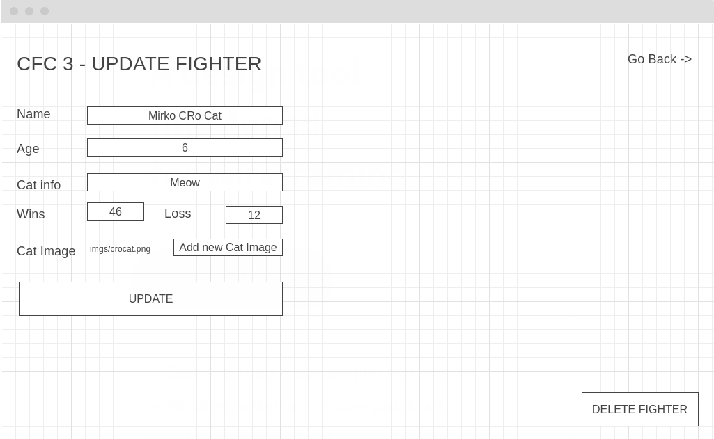

### Zadatak

Napomena: Html strukturu zadatka unutar **index.php** potrebno je promijeniti kako bi sadržavala dinamički kod za prikaz i potrebno ju je dodatno izmijeniti kako bi odgovarala Vašoj PHP logici (temeljnu html strukturu liste boraca i gumbova poželjno je da ne mijenjate kako ne biste morali raditi velike izmjene JavaScript logike). Zadatak mora sadržavati također svu logiku koja se nalazi unutar LV3 zadatka.

- JavaScript logiku iz LV3 potrebno je prenijeti i iskoristiti u ovome zadatku za već riješene funkcionalnosti (Simulacija borbe, odabir borca itd..).
- Dozvoljeno je kreiranje vlastite PHP strukture, logike, datoteka kao i MYSQL arhitekture (u vidu tablica i relacija) po volji.
- Potrebno je koristiti OO PHP, ali nije nužno sve pisati objektno unutar aplikacije.
- Potrebno je koristiti Interface-e i Namespace-ove (Primjer u LV5 predlošku) prilikom pisanja OO PHP-a.
- Potrebno je dokumentirati i pisati komentare nad metodama i funkcijama unutar pojedinih dijelova koda(/** */) 
- Za MYSQL možete koristiti PHP-ov MYSQLi ili PDO objekt
- Heroku Cloud MYSQL baza ima limit od 5MB i potrebno kompresirati (smanjit) slike ako se odlučite spremati slike unutar baze na način koji je opisan u zadatku.

**Navedeni kod zadatka potrebno je postaviti na github repozitorij ili možete napraviti vlastiti fork (gumb gore) ovog repozitorija i unutar Vašeg forka riješiti zadatak u ovoj datoteci (LV5/Zadatak1). Potrebno je napraviti SQL dump Vaše baze (Tablice) i postaviti unutar git-a.**

**Osim postavljenog koda zadatka potrebno je podignuti rješenje zadatka na Heroku server ili na neki drugi od Cloud servisa (ili hostanog servera) po Vašoj volji.**

#### Intro

Nakon tvoje pomoći i dobrog obavljenog posla, Nikola je dobio dobar bonus na plaću. Nikola kakav je, odmah se hvalio svojim prijateljima i kolegama iz drugih firmi. Goran kad je čuo za to, dao je otkaz i priključio se Nikolinoj ekipi bez dodatnog nagovaranja. Kako je Goran bekendaš, Nikola mu je proslijedio zadatak kako bi se što bolje pripremio za novo radno mjesto.

Specifikacije zadatka su sljedeće:

#### Opis zadatka

Klijent je zadovoljan prijašnjom implementacijom aplikacije i želi proširiti funkcionalnosti svoje aplikacije. Umjesto hardkodiranih vrijednosti, klijent želi imati podatke boraca koji su pohranjeni unutar baze podataka i dinamički se prikazuju. Klijent želi imati navedene backend funkcionalnosti napisane u PHP-u.

1. Na početnoj stranici aplikacije potrebno je kreirati gumb dodaj borca. Lokacija gumba je proizvoljna.
    

2. Gumb kreiraj borca vodi na novu stranicu gdje koristim može kreirati svog novog borca. Potrebno je napraviti validaciju koja neće kreirati borca dok sva polja nisu popunjena odgovarajućim vrijednostima. Kada korisnik stisne na Submit dugme potrebno je unijeti novog borca u bazu. 
   - (Pomoć: **1. Način:** Pohranite sliku u određeni direktorij korištenjem $_FILES superglobalne varijable, a zatim putanju slike zapiše unutar baze. **2.Način:** Unutar MYSQL baze koristite BLOB tip podatka za spremanje slike u bazu.)
  
   

3. Nakon što korisnik unese novog borca u bazi, potrebno ga je vratiti na početni zaslon. Na frontendu potrebno je dinamički prikazati borca s njegovim podacima koje je potrebno povući iz baze podataka. Osim dinamički prikazane strukture borca borac mora imati unutar svoga data-info povučene vrijednosti iz baze, za razliku od prijašnjih hardkodiranih vrijednosti koje su se gubile prilikom osvježavanja preglednika
   
   

4. Prilikom simulacije borbe, također gumbi za dodaj borca i Edit borca moraju biti disable-ani sve dok traje simulacija. Simulaciju je potrebno proširiti na sljedeći način:
    - Kada simulacija završi potrebno je napraviti POST ili GET request pomoću Fetch Api-a na skriptu koja će dohvatiti borce i ažurirati njihov status pobjeda i poraza boraca unutar baze. Razlog tomu je ako se napravi refresh preglednika, novi podatci neće biti obrisani za razliku od prijašnje implementacije.
    - Nakon što simulacija završi moguće je ponovno dodavati nove borce ili ažurirati postojeće.

    

5. Kada korisnik klikne na Edit gumb borca, potrebno je otvoriti mu novu stranicu gdje može izmijeniti podatke borca. Za razliku od kreiranja novog borca, može proizvoljno promijeniti određene podatke ali ih ne smije ostaviti praznima. Nakon klika na gumb za ažuriranje potrebno je vratiti korisnika na početni zaslon gdje će nakon što klikne na borca unutar glavnog izbornika vidjeti njegove ažurirane podatke koji su dohvaćeni iz baze. Također korisnik ima mogućnost brisanja borca koji će obrisati navedenog borca iz tablice.
    - *(Pomoć: Može se koristiti forma bez fetch-a koja će odvesti korisnika na novu stranicu s GET requestom (pr. update?id=vrijednost))*
  
    

